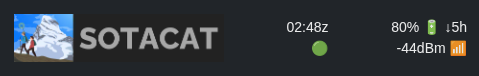

# Getting Started

**Who this is for:** First-time SOTAcat users
**Time:** 5 minutes
**Prereqs:** SOTAcat device, Elecraft KX2/KX3/KH1, smartphone

## Connect to SOTAcat

1. Power on your radio with SOTAcat attached
2. On your phone, go to WiFi settings
3. Connect to `SOTACAT_xxxx` (password: `12345678`)

## Open the Web Interface

Browse to: `http://192.168.4.1`

Alternative: `http://sotacat.local` (may not work on some Android devices)

## Verify It's Working

You should see the SOTAcat header with:
- UTC time (updates every 10 seconds)
- Battery percentage and icon
- WiFi signal strength (dBm)
- Green connection indicator

**Success!** You're connected.

## One-Time Setup

In Settings, configure:

1. **Callsign** — Your amateur radio callsign
2. **License class** — For band privilege indicators
3. **WiFi networks** — See [Networking](Networking.md) for WiFi mode options

## Next Steps

1. [UI Tour](UI-Tour.md) — learn what each tab does
2. [Set up an activation](UI-Tour.md#qrx--setup--preparation) — clock, location, reference

---

**Problems?** See [Networking](Networking.md) or [Troubleshooting](Troubleshooting.md)

[Next: UI Tour →](UI-Tour.md)

