# UI Tour

**Who this is for:** Users who want to understand the interface
**Prereqs:** [Getting Started](Getting-Started.md)

SOTAcat has five tabs at the bottom of the screen.

## QRX — Setup & Preparation

Prepare for your activation before operating.

- **Clock Sync** — Sync radio clock to your phone

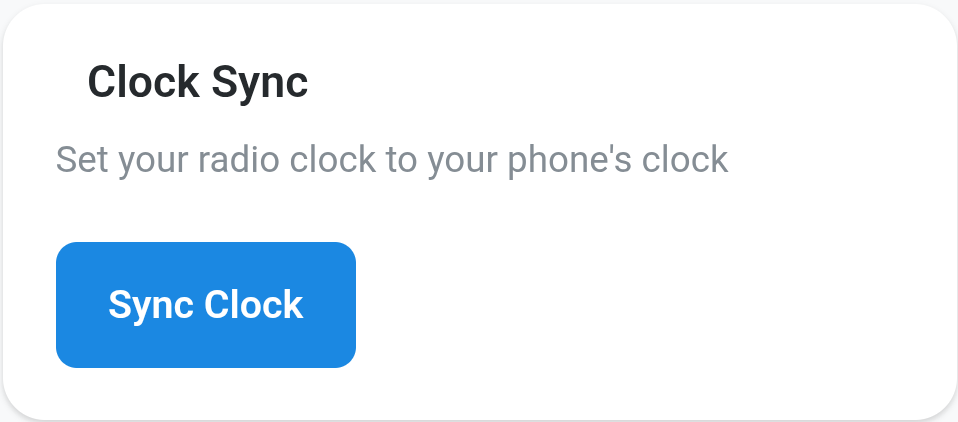

- **Location** — Set GPS coordinates (manual or "Locate Me")
- **Activation Reference** — Enter your summit/park ID

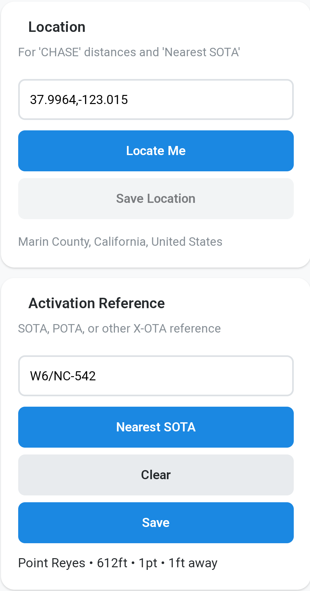

- **Nearest SOTA** — Find closest summits to your location

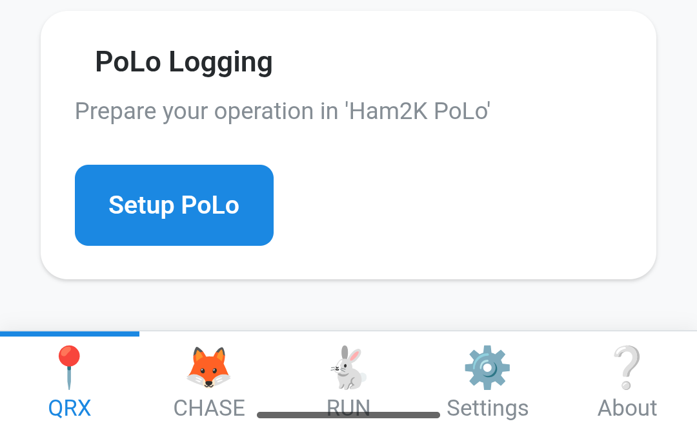

## CHASE — Click-to-Pounce

Hunt activators from the spot list.

- Tap any spot → radio tunes automatically
- Filter by mode (CW, SSB, DATA) or type (SOTA, POTA, WWFF)
- Distance shown based on your saved location
- Opens WebSDR/KiwiSDR if tune targets configured

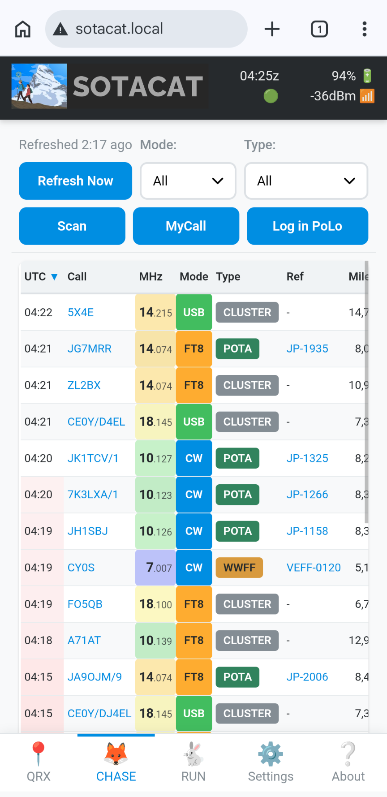

> **Note:** CHASE requires internet. When offline, this page will be empty.

## RUN — Operate

Control your radio during activation.

**Tune section:**
- VFO display with frequency/mode
- Band buttons (40m, 20m, 17m, 15m, 12m, 10m)
- Mode buttons (CW, SSB, DATA, AM, FM)
- Power and ATU controls

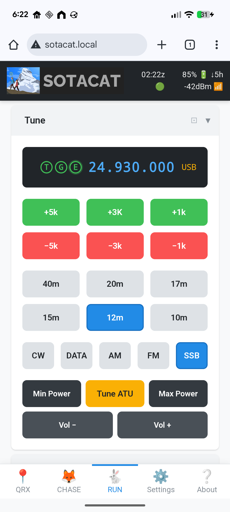

**Spot section:**
- SOTAmat button (FT8 self-spot, works offline with gateway coverage)
- SMS Spot / SMS QRT (requires cell service)

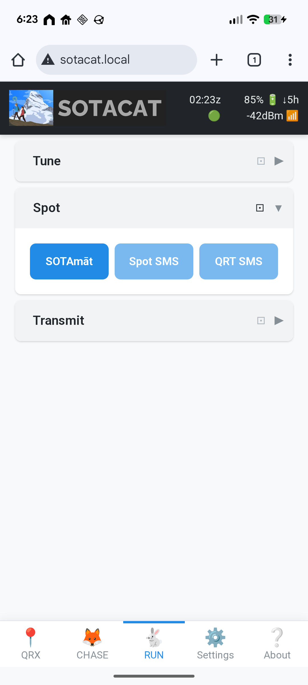

**Transmit section:**
- TX toggle
- CW keyer (3 message slots, 24 chars each)

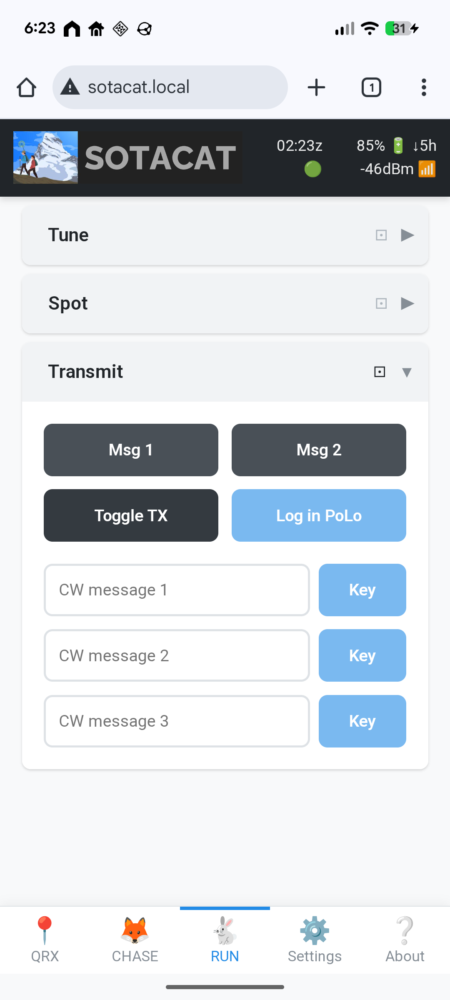

**Tip:** After self-spotting, use split-screen mode with PoLo (or your preferred logging app) on top and SOTAcat's Transmit section on the bottom. This gives you one-tap access to TX, CW keyer messages, and your log — ideal for working a pileup right after spotting yourself.

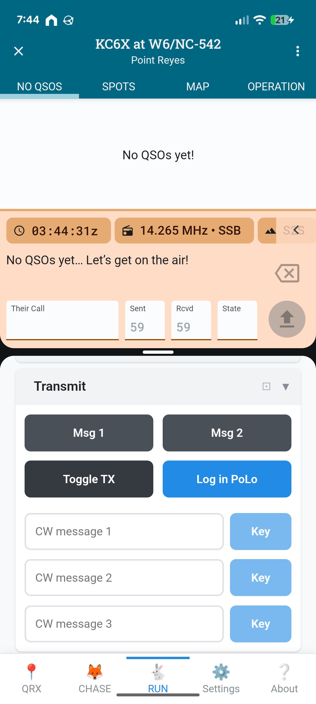

## Settings — Configuration

One-time setup and preferences.

- Callsign and license class
- WiFi networks (home, phone hotspot, AP mode)

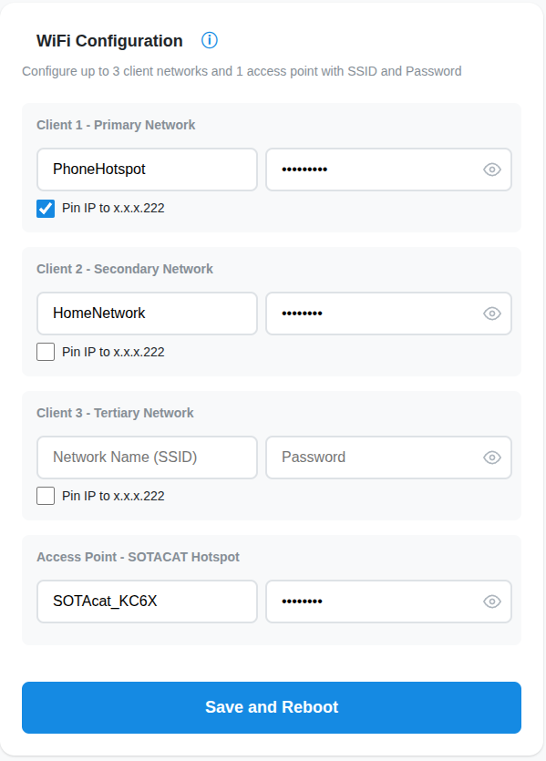

- Tune targets (WebSDR/KiwiSDR URLs)

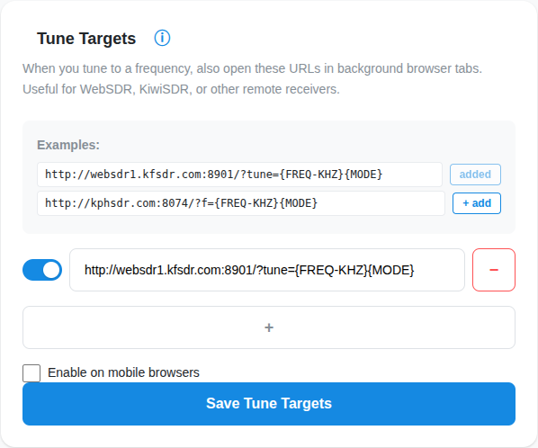

- Display settings (compact mode)

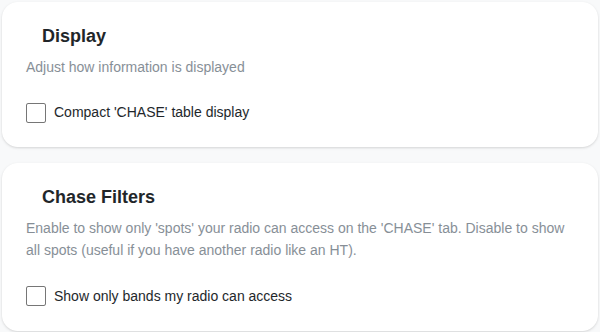

- Firmware updates

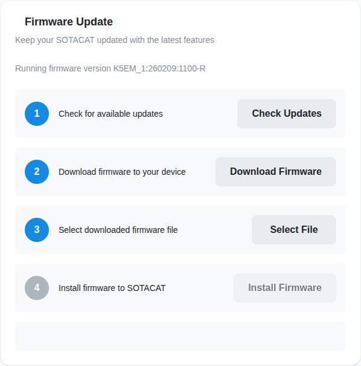

## About — Info

Firmware version, attribution, and licenses.

---

[← Getting Started](Getting-Started.md) · [Networking →](Networking.md)

