# UI Tour

**Who this is for:** Users who want to understand the interface
**Prereqs:** [Getting Started](Getting-Started.md)

SOTAcat has five tabs at the bottom of the screen.

## QRX — Setup & Preparation

Prepare for your activation before operating.

- **Clock Sync** — Sync radio clock to your phone

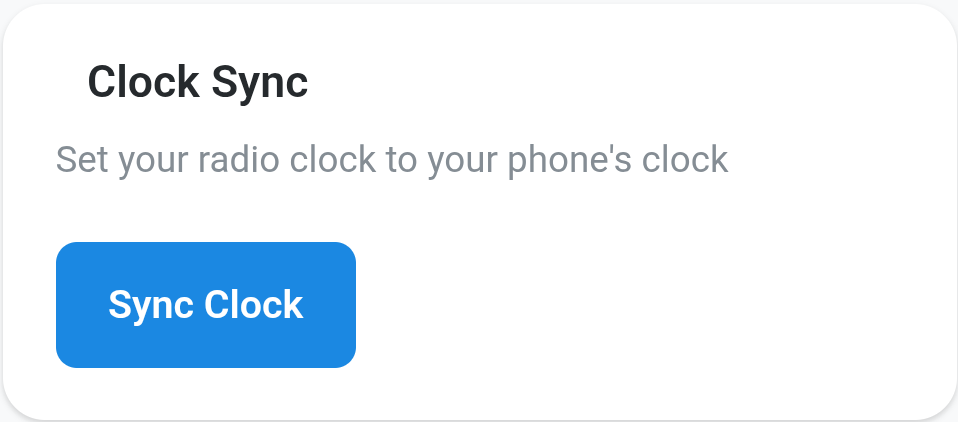

- **Location** — Set GPS coordinates (manual or "Locate Me")
- **Activation Reference** — Enter your summit/park ID

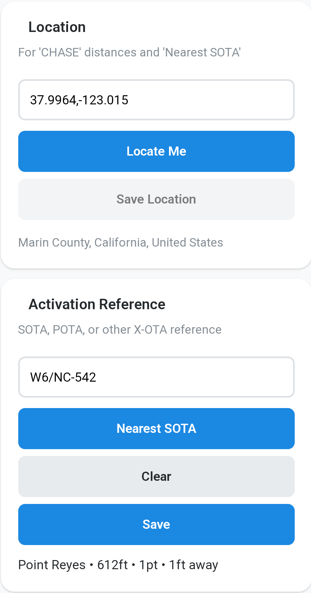

- **Nearest SOTA** — Find closest summits to your location

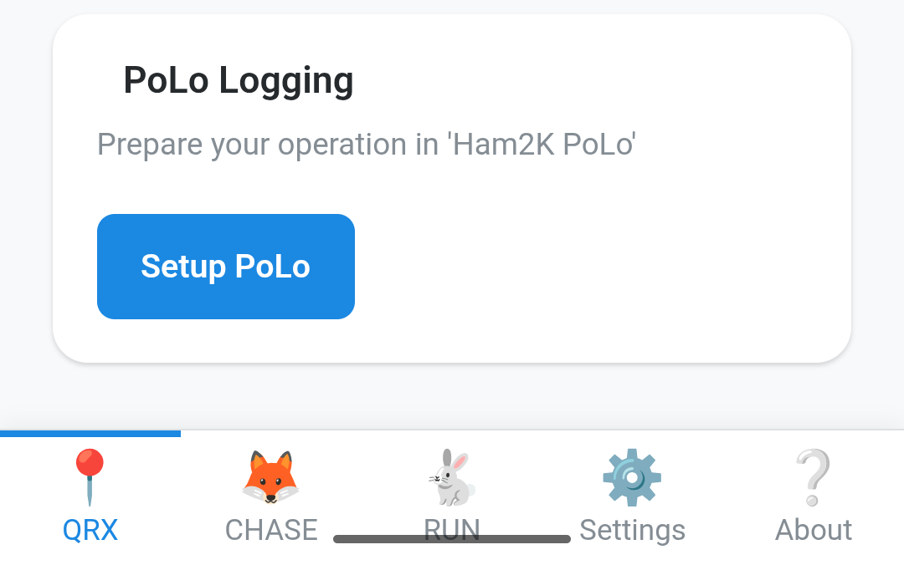

## CHASE — Click-to-Pounce

Hunt activators from the spot list.

- Tap any spot → radio tunes automatically
- Filter by mode (CW, SSB, DATA) or type (SOTA, POTA, WWFF)
- Distance shown based on your saved location
- Opens WebSDR/KiwiSDR if tune targets configured

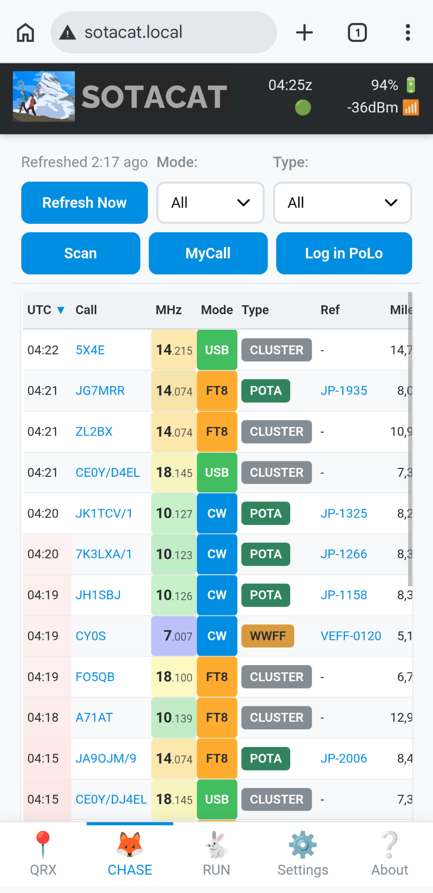

**Scan** — Press the Scan button to automatically cycle through visible spots. The radio tunes to each spot in turn and the row scrolls into view. The button changes to "Stop" while scanning. Any other interaction (refresh, filter change, column sort, row click, MyCall, or Log in PoLo) stops the scan.

Scan resumes from where you left off: if you've stopped a scan, clicked a row, used arrow keys, or the radio is already tuned to a spot in the list, pressing Scan continues from the row *after* that one. If nothing is selected or tuned, scan begins at the top.

**Keyboard shortcuts (desktop):**
- **Space** — start/stop scan
- **j** / **k** — move down/up through spots (stops any active scan)

Scan dwell time is configurable in Settings → Display (default 7 seconds).

> **Note:** CHASE requires internet. When offline, this page will be empty.

## RUN — Operate

Control your radio during activation.

**Tune section:**
- VFO display with frequency/mode
  - **Band-range graph** at the top is a stack of thin horizontal rows, one per visible license class (top = Extra, bottom = Technician; Novice/Advanced rows appear only when your configured license is one of those legacy classes). Each row's filled segments show where that class has FCC privileges across the current band; empty stretches mean the class has no access there. The coloring is **operator-centric**: a **solid** segment is colored by your current radio mode (blue = CW, yellow = DATA, green = PHONE) and means you can operate there in that mode; a **striped** segment means your current mode is forbidden but the segment is open to one or more other modes — the stripes show which modes would let you operate there if you switched. The colors rotate when you change modes (e.g. switch from SSB to CW and the SSB-permitted greens become CW-permitted blues; areas that allowed only DATA+CW go from striped blue+yellow to solid blue). A single white tick spans the whole stack at the dial frequency, with a faint band around it showing the mode's occupied bandwidth; the tick turns red when you can't legally transmit in your current mode. Hovering a segment shows the class, exact frequency range, and full FCC mode list.
  - License-class badges on the left light up to show who is permitted to operate at the current frequency/mode.
  - Mode indicator on the right.
- Band buttons (40m, 20m, 17m, 15m, 12m, 10m)
- Mode buttons (CW, SSB, DATA, AM, FM)
- Power and ATU controls

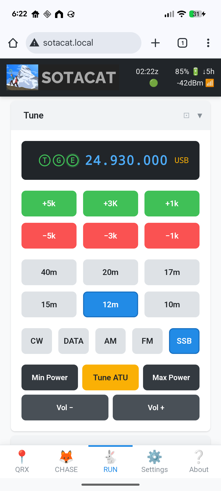

**Spot section:**
- SOTAmat button (FT8 self-spot, works offline with gateway coverage)
- SMS Spot / SMS QRT (requires cell service)

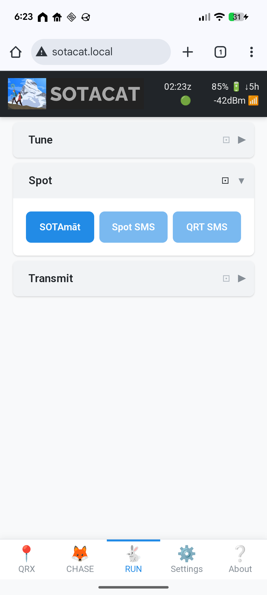

**Transmit section:**
- TX toggle
- Configurable CW macro buttons with placeholder support (`{MYCALL}`, `{MYREF}`, etc.)
- Configure macros in Settings → CW Macros
- Macros are keyed in the radio's current mode: CW in CW/CW-R, RTTY in DATA + FSK-D, PSK31 in DATA + PSK-D. In SSB/FM/AM the radio is switched to CW temporarily and restored when done.

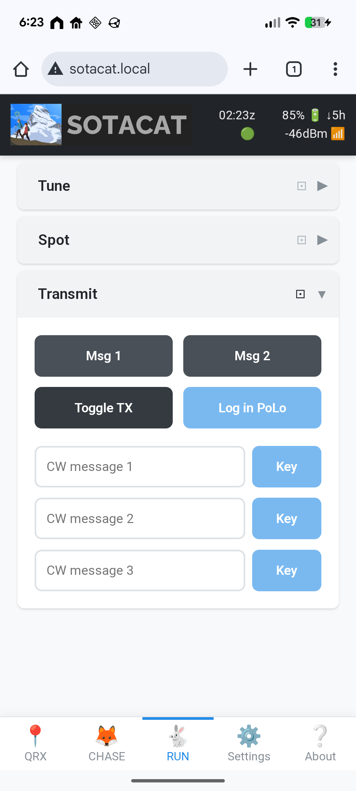

**Tip:** After self-spotting, use split-screen mode with PoLo (or your preferred logging app) on top and SOTAcat's Transmit section on the bottom. This gives you one-tap access to TX, CW macro buttons, and your log — ideal for working a pileup right after spotting yourself.

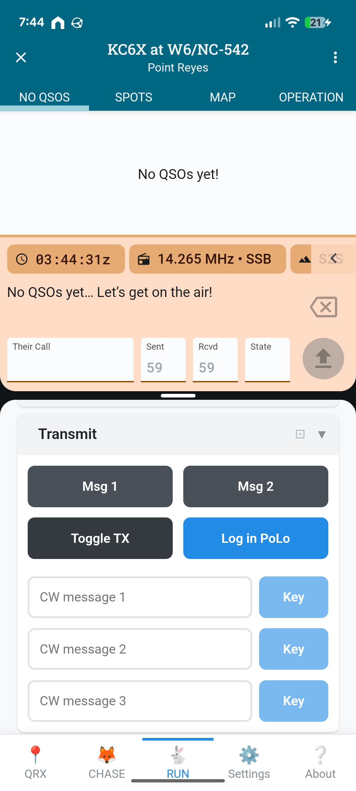

## Settings — Configuration

One-time setup and preferences.

- Callsign and license class
- WiFi networks (home, phone hotspot, AP mode)

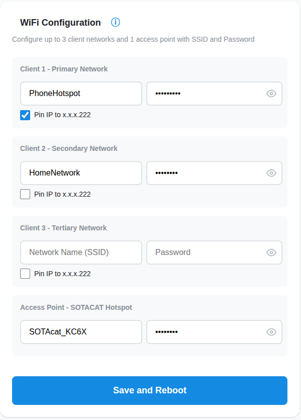

- Tune targets (WebSDR/KiwiSDR URLs)

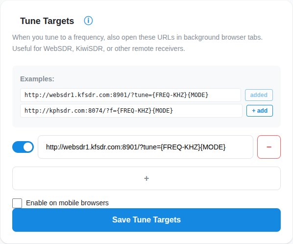

- CW macros (configurable keyer buttons with placeholders)
- Display settings (compact mode, scan dwell time)

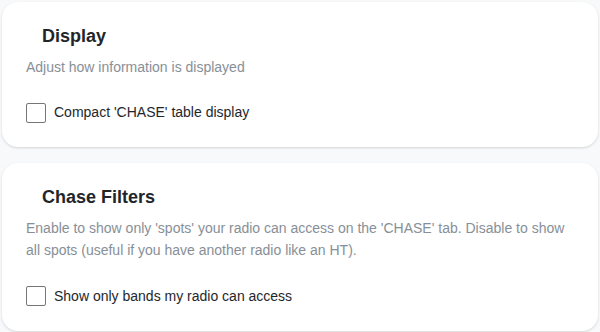

- Firmware updates

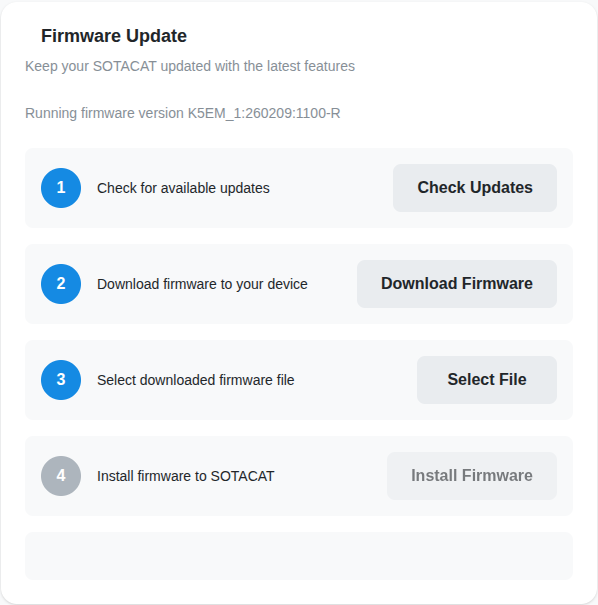

## About — Info

Firmware version, attribution, and licenses.

---

[← Getting Started](Getting-Started.md) · [Networking →](Networking.md)

