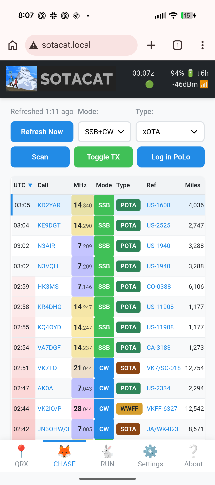
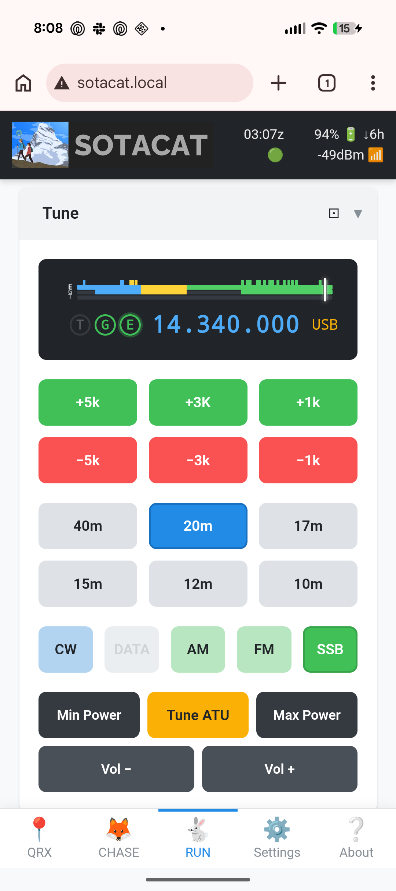

# SOTAcat — Wireless Rig Control for Field Ops

WiFi CAT control for Elecraft KX2/KX3/KH1. Your phone becomes your radio console.

## Highlights

### Chase contacts with click-to-pounce

Tap a spot, radio tunes. Scan to cycle through spots hands-free. SOTA, POTA, WWFF—all in one list.

### Control your rig and spot in all conditions

Full rig control, CW keyer, and self-spotting—even off-grid via FT8.

## Get Started in 60 Seconds

1. **Connect** — Join WiFi `SOTACAT_xxxx` (password: `12345678`)
2. **Open** — Browse to `http://192.168.4.1` or `http://sotacat.local`
3. **Verify** — You should see the header bar with UTC time, battery %, and green connection dot

> **Android note:** `.local` addresses may not work. Use `192.168.4.1` or see [Networking guide](docs/user/Networking.md).

## In the Field

### No Cell Service (Offline)

- **RUN** works fully: tune radio, send CW, toggle TX
- **CHASE** requires internet (empty when offline)
- Self-spot via **SOTAmat** FT8 synthesis (requires [SOTAmat app](https://sotamat.com) — [iOS](https://apps.apple.com/us/app/sotam%C4%81t-sota-pota-spotting/id1625530954) · [Android](http://play.google.com/store/apps/details?id=com.sotamat.SOTAmat&hl=en_US))

### With Cell Service

- **CHASE** live spots with tap-to-tune and auto-scan
- SMS Spot / SMS QRT buttons
- Full click-to-pounce workflow

> **Page not responding?** See [Networking troubleshooting](docs/user/Networking.md#connection-lost-recovery)

## Documentation

**Users:** [Getting Started](docs/user/Getting-Started.md) · [UI Tour](docs/user/UI-Tour.md) · [Networking](docs/user/Networking.md) · [Troubleshooting](docs/user/Troubleshooting.md)

**Developers:** [Build](docs/dev/BUILD.md) · [Architecture](docs/dev/Architecture.md) · [Web UI](docs/dev/Web-UI.md) · [Testing](TESTING.md)

**Hardware:** [Get a SOTAcat](docs/Hardware.md)

## Get a SOTAcat

- **Buy pre-made:** [K5EM's Store](https://store.invertedlabs.com/product/sotacat/)
- **Build your own:** [Hardware guide](docs/Hardware.md)

## Support

- **Bug?** [GitHub Issues](https://github.com/SOTAmat/SOTAcat/issues)
- **Suggestion?** [GitHub Discussions](https://github.com/SOTAmat/SOTAcat/discussions)
- **Help?** #sotacat-sotamat on SOTA-NA Slack — [how to join](docs/user/FAQ.md#slack)
