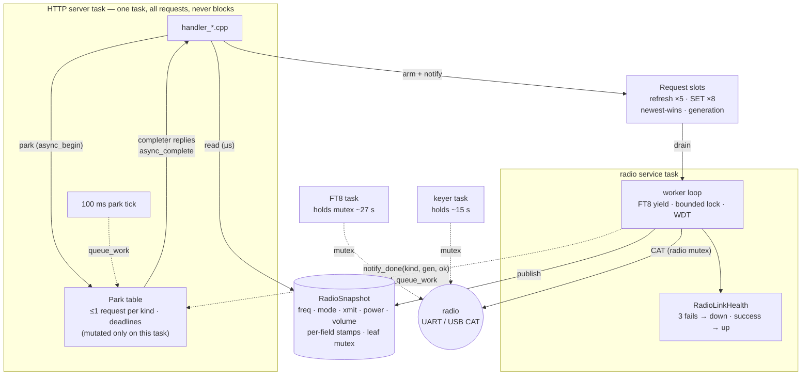
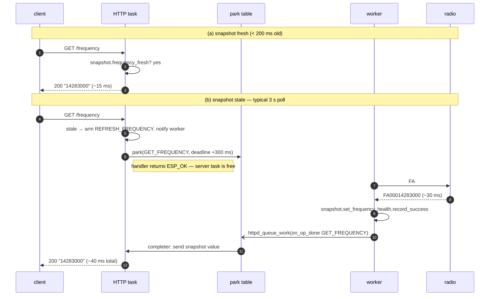
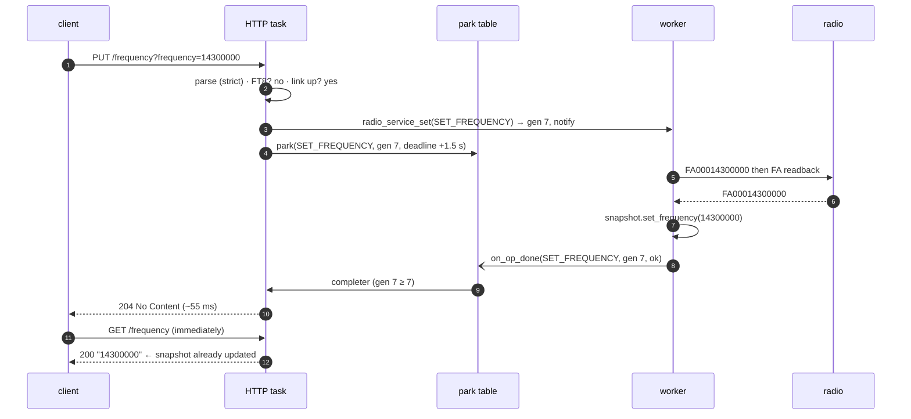
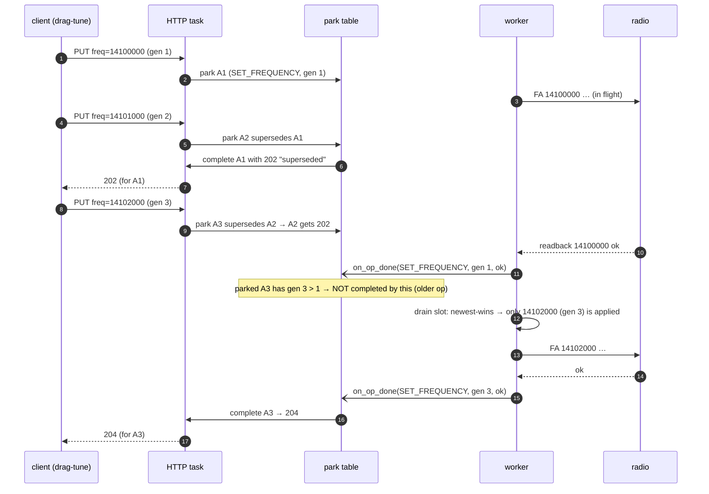
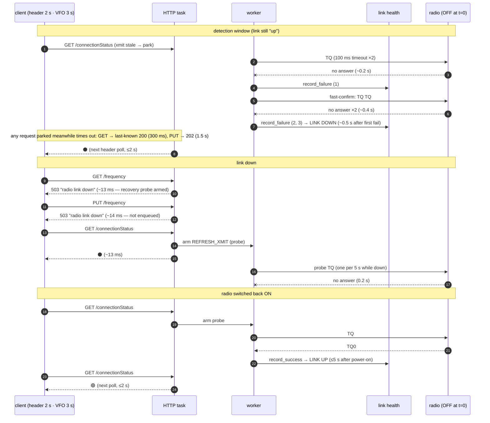
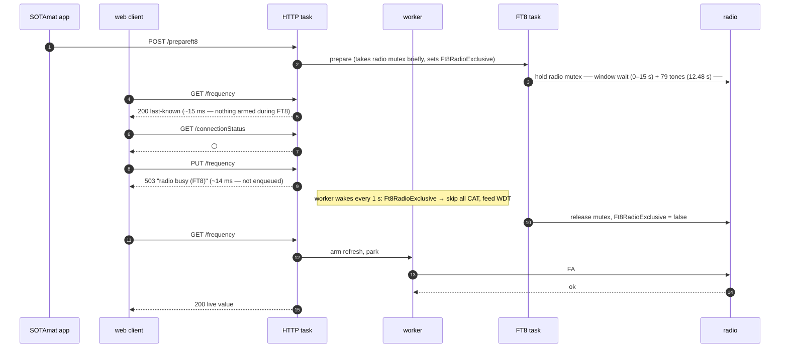
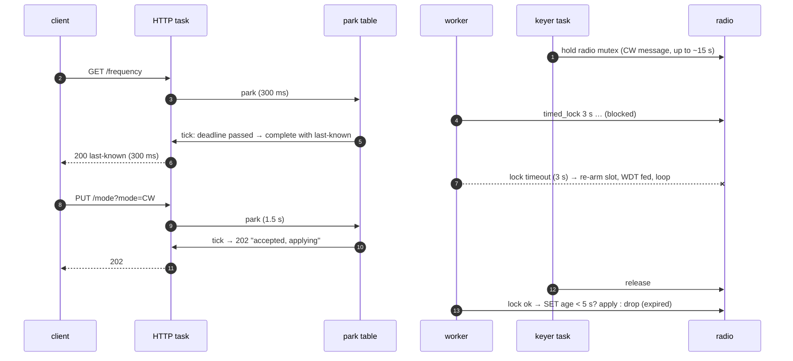
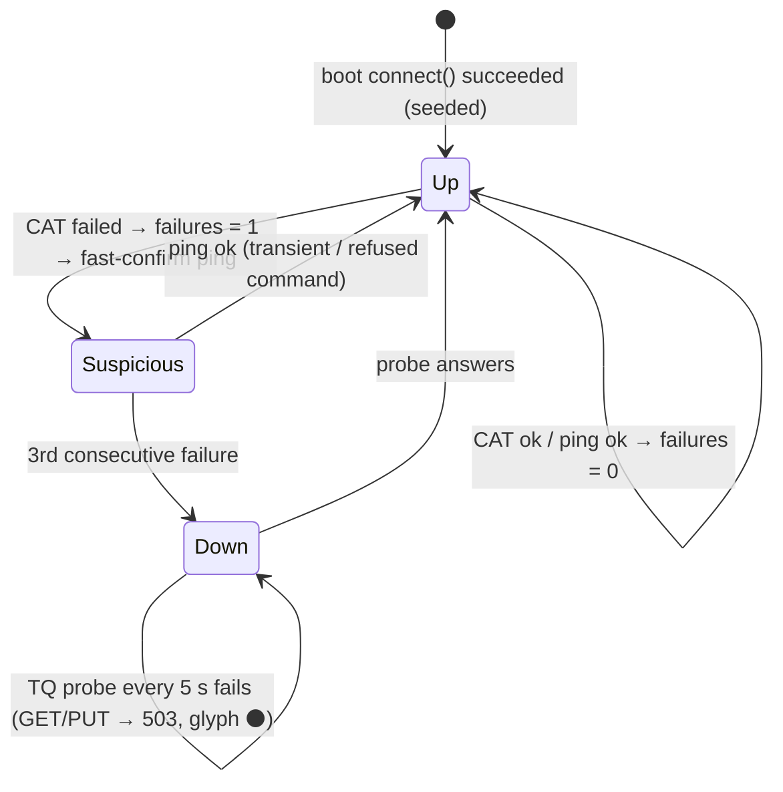

# Radio Access Model

**Who this is for:** Developers touching anything between an HTTP handler and the
radio — `radio_service.*`, `radio_snapshot.*`, `radio_park*.*`, `radio_set_http.*`,
`handler_*.cpp`.

ESP-IDF's `esp_http_server` runs **every** request on **one** task. On the original
design each radio handler did a synchronous CAT exchange inside that task, so one
request against a slow or powered-off radio (~6 s UART timeout) froze the entire web
UI. This document describes the model that replaced it and — because the design is
entirely about *who waits on whom* — shows it as timelines. Timings are the ones
measured on a KX2 (2026-08-17), not idealized.

Related documents:

- [Architecture](Architecture.md) — where this fits in the system
- `docs/superpowers/specs/2026-05-15-radio-decoupling-design.md` and
  `docs/superpowers/specs/2026-08-17-radio-async-handlers-design.md` — design rationale
- `docs/for-AI-agents/radio-service-ft8-mutex-contention.md` — the FT8 constraint

---

## 0. Background — why this exists

`esp_http_server` services **all** requests on one task. Originally
`handler_frequency_get`, `get_radio_mode`, `handler_connectionStatus_get` and every
SET handler took the radio mutex and did a synchronous CAT exchange on that task:

```
                ESP-IDF esp_http_server  —  ONE task, requests serialized
                ┌──────────────────────────────────────────────────┐
 GET /frequency ─▶│ handler_frequency_get                            │
 GET /run.html  ─▶│   kxRadio.timed_lock()                           │──▶ UART ──▶ KX2
 GET /settings  ─▶│   get_from_kx("FA")  ◀──── ~6 s ────┐            │   (radio OFF:
 GET /mode      ─▶│   ▒▒▒▒▒▒▒▒▒▒ BLOCKED ▒▒▒▒▒▒▒▒▒▒     │            │    never replies)
                │   every other request waits in line  │            │
                └──────────────────────────────────────────────────┘
        radio off  →  6 s block per poll  →  whole UI frozen, QRT button stuck
```

With the Run page polling `frequency` and `mode` every 3 s, a powered-off radio meant
each poll blocked the one server task for ~6 s: tab navigation, Settings and the
client-only QRT SMS button all stalled. A second gap: `kxRadio.is_connected()` was set
once at boot and never cleared, so the header could not report a radio switched off
later. The model below removes both: radio I/O lives on its own task, handlers never
wait on it, and link health is explicit and live.

Design history: the May 2026 spec introduced the service task, snapshot and slots
with fire-and-forget SETs; the August 2026 spec added parked async handlers so SETs
answer honestly (204/500) and GETs are live again, then hardware testing added
fast-confirm/recovery probing, converted the remaining handlers, and made numeric
parameters strict.

---

## 1. Components



Rules that make it hold together:

- **Handlers never call `kxRadio.*`.** They read the snapshot, arm a slot, and either
  reply now or *park*.
- **Parking** = `httpd_req_async_handler_begin()`: the request is detached from the
  server task, which immediately serves the next socket. A parked request ties up its
  own socket only; a completer sends its reply later. Parked sessions bypass httpd's
  LRU purge, so **every park has a deadline** (GET 300 ms, SET 1.5 s) enforced by a
  100 ms tick. All park-table mutation and all sends happen on the server task
  (reached via `httpd_queue_work`), so the table needs no lock.
- **The worker is the only HTTP-side radio-mutex user.** FT8 and the CW keyer task
  still take it directly; the worker yields to FT8 outright and bounds its lock waits
  (3 s) with slot re-arm.
- **Slots coalesce.** One pending entry per kind, newest-wins (volume deltas
  accumulate); every arm bumps a generation, so a completion can be matched to the
  request that armed it.
- **Snapshot mutex is leaf-level**: never call `kxRadio.*` while holding it; taking it
  under the radio mutex is fine.

---

## 2. Simple GET — fresh vs stale



If the refresh has not finished by the deadline, the 100 ms tick completes the parked
request with the **last-known** value (still 200). Every reply payload is byte-identical
to the pre-async firmware. Measured: p50 19 ms, p95 ~40 ms; a VFO knob turn shows on
the *next* poll.

---

## 3. Simple PUT and read-your-write



Outcomes a parked PUT can receive:

- **204** — applied; the radio confirmed the readback
- **500** — the radio refused (`ok == false`)
- **202** "accepted, applying" — confirmation outran the 1.5 s bound (a KX2 mode
  change is 375–680 ms, a band change about 1.5 s); the apply continues asynchronously
- **202** "superseded" — a newer same-kind PUT arrived first

`mode=SSB` is resolved to LSB/USB by the worker **at apply time**, after any frequency
SET queued ahead of it, so a tune-then-SSB sequence lands on the right sideband.

---

## 4. Overlapped requests — coalescing, supersede, generation gate



Twelve rapid PUTs become one or two CAT tunes; the radio never chases intermediate
frequencies; the client's own newer request is what made the older one moot. Two
*different* clients parking the same GET kind behave the same way — the earlier one is
answered immediately with the current snapshot value.

---

## 5. Radio switched off — detection, link-down, recovery



Why it looks like this: a dead-radio **`FA;`/`MD;` read is ~4 s and a `set_frequency`
~18 s** (three attempts × two 2 s "long command" reads + gaps). Fast-confirm pings
turn one such failure into a link-down decision in ~0.5 s instead of waiting for two
more slow ops; while down, only the 0.2 s `TQ;` probe touches the radio, so a dead
radio costs 0.2 s of CAT per 5 s and recovery is ≤5 s. `connectionStatus` arms the
probe itself so recovery never depends on which tab or client is polling. If a **SET**
is the first op to hit a freshly-dead radio it still costs its full ~18 s (the worker
resets the WDT *after* acquiring the lock, so that op is inside the 20 s budget); a
"suspicious" worker (previous op failed) pre-flights a `TQ;` before any further SET.

Client behaviour by design: web UI treats non-OK as "no update" and shows ⚫; SOTAmat
(polls only frequency/mode) sees a real failure and flags the radio, exactly as it did
on the pre-async firmware — minus the 6 s server stalls.

---

## 6. FT8 overlap



Measured with three back-to-back transmissions and two browsers polling: every
transmission `12480 ms`, no `radio_service` watchdog, PUTs 503 in ~14 ms.

---

## 7. Lock contention — the keyer (or any long direct holder)



Header shows 🔴 while `is_keyer_active()`. The 5 s `SET_APPLY_DEADLINE_MS` is what
keeps a tune from landing long after the tap.

---

## 8. Link-health state machine



- Failures come only from real CAT attempts. A **skipped/expired SET** and a **failed
  lock acquire** are not failures. A **refused command** on a live radio is reset by
  the confirm ping, so it does not count against the link.
- `radio_service_link_up()` is the single truth consulted by `connectionStatus`, the
  SET fast-reject, and the GET 503 path.

---

## 9. Budgets and constants

| what | value | where | why |
|---|---|---|---|
| snapshot freshness | 200 ms | `radio_snapshot.h` | below any client's poll; stale → refresh+park |
| GET park wait | 300 ms | `radio_park_httpd.h` | healthy CAT read 20–60 ms + margin |
| SET park wait | 1.5 s | `radio_park_httpd.h` | covers a KX2 band change; sockets idle meanwhile |
| SET apply deadline | 5 s | `radio_service.h` | never tune long after the tap |
| park cap | 8 | `radio_park_httpd.h` | ≤ `max_open_sockets` 12 minus page assets |
| worker lock acquire | 3 s | `radio_service.cpp` | must stay well under the 20 s task WDT |
| link-down threshold | 3 | `radio_link_health.h` | anti-flap |
| link-down probe | `TQ;` every 5 s | `radio_service.cpp` | 0.2 s per probe on a dead radio |
| worst single CAT op | ~18 s (dead-radio FA/MD/PC set) | measured | WDT reset *after* lock; `put_to_kx` feeds WDT |
| header poll | 2 s | `main.js` | bounds what the user sees |

Resource readings under a 40-way burst and a 2 h soak: worker stack peak ≈2 KB of 4 KB,
httpd ≈2.7 KB of 10 KB, largest free heap block unchanged (no fragmentation from park
copies), parked occupancy typically 0–1.

---

## 10. Validation record (2026-08-17, K5EM_1 + KX2)

- **Host unit tests** (`test/host/`, `make test`): link health (threshold, anti-flap,
  failure counter), snapshot freshness (boundary, clock skew), park table (supersede,
  generation gate incl. wraparound, expiry, cap).
- **Contract test** (`test/integration/test_radio_contract.py`; `make -C
  test/integration test-contract[-mock]`): payload shapes and bounds, strict-param
  404s, read-your-write for frequency/mode/power, SSB-after-tune, SOTAmat's exact
  poll/write sequences, burst vs `/version` control; on the mock additionally
  radio-dead (503, ⚫, recovery), FT8 (503, ⚪), slow-CAT (202 then applied). Mock
  18/18 healthy and 13/13 dead; **hardware 15/15** on the release build.
- **Existing suites**: performance baseline equal or better on every metric; 60 s
  7-client mutex stress 99.89 % (remaining fails are 1 s client timeouts from SYN
  retransmits); Playwright UI 71/71.
- **Scenarios on hardware**: VFO knob → next poll; radio off → ⚫ in ~2 s, GETs 503,
  PUTs 503, `/version` 15 ms throughout; radio on → 🟢 in ~3 s (≤5 s probe, 2 s poll);
  FT8 ×3 with two browsers polling and a 1 Hz PUT probe — every PUT 503 in ~14 ms,
  `ft8 transmission time: 12480 ms` on all three, no watchdog; PUT-through-detection:
  in-flight SET takes its ~18 s (parked PUTs bounded 202), next SET fails fast on the
  pre-flight ping, then 503s, no watchdog.
- **Adversarial sockets**: 300 abort-while-parked connections, 40-wide same-kind GET
  and PUT storms (superseded → 202, last-wins), a 1-byte/s slow reader — every socket
  free afterwards, `/version` 13 ms; console shows only the expected `recv/send: 104`.
- **2 h mixed soak** (two header pollers, two VFO pollers, SOTAmat-style 1 s poller,
  asset reloads, tune round-trip every 20 s, mode toggle every 3 min): 33,499
  requests, 0 errors, all PUTs 204, latencies flat, largest free heap block 114,688 B
  at every sample, worker stack min-free 2076 B flat, no reboot. Diagnostics stay
  behind `-DSOTACAT_SOAK_DIAG` (`PLATFORMIO_BUILD_FLAGS=-DSOTACAT_SOAK_DIAG`).
- **Boot with the radio absent** (2026-08-18): web server up while `connect()`
  searched; `/version` 14–28 ms, header ⚫, every radio endpoint refused instantly
  with the pre-existing gate's `500 "radio not connected"` (the service starts only
  after connect), all tabs usable; radio on → 🟢 within one 2 s poll and the first
  PUT after connect a 204 (health seeded from `connect()`).
- **CW-keyer overlap** (2026-08-18): four keyer messages (~30 s of keying) with two
  clients writing: header 🔴 throughout; GETs 200 last-known in 300–400 ms (worker's
  3 s lock acquire fails, slot re-arms); PUTs 202 while keying (timeout, or
  "superseded" by the other client's PUT) and 204 in the gaps and afterwards; no
  watchdog.

## 11. Known limitations and future work

- **A SET as the first op against a freshly-dead radio** costs its full ~18 s before
  detection (the polls' GETs usually fail first, in 0.5–4.5 s). The pre-flight ping
  bounds everything after it.
- **Wide parallel-connect bursts** (>~12 simultaneous connections) show +1 s/+3 s
  SYN-retransmit steps on every endpoint — the ESP accept backlog, not the radio
  path; the contract test therefore compares against a `/version` control.
- **Client-side observation, unresolved**: once, a phone's Chase tab issued no VFO
  GETs for 35 s after its initial fetch while `connectionStatus` kept polling. The
  server no longer depends on it (`connectionStatus` arms the recovery probe); if
  Chase's row highlighting ever looks frozen, look at `startGlobalVfoPolling` /
  `openTab`'s `pollingPaused` race.
- **Phase-2 client work (optional)**: enable client-only buttons synchronously from
  `localStorage`, and pause/back off VFO polling while ⚫ — now safe to do. Worth
  pairing with collapsing `run.js`'s own VFO poller into `main.js`'s and deleting the
  load-protection heuristics the non-blocking server made unnecessary.
- **rigctld** (`feature/rigctld-server`) is a client of this service: GETs use
  `radio_service_refresh_wait` + the snapshot, SETs `radio_service_set` +
  `radio_service_set_wait` (blocking is fine on its own task; only `send_morse`
  takes the mutex directly, via the sanctioned keyer claim). Future richness —
  meters (S/SWR/ALC) and split — would be snapshot fields plus new command kinds.
- **USB-host radios** (`rdarden/feat/esp32-s3-usb-otg`, QMX and IC-705): the model
  applies unchanged; at merge, feed the task WDT from the transport read
  (`KXRadio::cat_read_bytes`) because an IC-705 native ATU tune can run ~16–34 s in
  one worker op.

## 12. Adding an endpoint

1. Add a `RadioCmdType` (in the contiguous REFRESH or SET block) and, for GETs, a
   snapshot field + freshness predicate; extend `radio_service_park_kind()`.
2. Worker: handle it in `do_refresh` / `do_set`, publish to the snapshot on success.
3. GET handler: fresh → reply; else arm refresh; link down → 503; else park with a
   completer that formats from the snapshot. PUT handler: validate with
   `parse_long_param`, then `return radio_set_via_http(...)`.
4. Mock (`test/mock_server/server.py`) and contract test
   (`test/integration/test_radio_contract.py`): mirror the contract; never probe a
   live radio with a value that could change the operator's setting.
5. Check the op's dead-radio worst case against the 20 s WDT (see §9).
6. If the op is reachable over rigctld: pure protocol logic goes in
   `include/rigctld_proto.h` (host-tested by `test/host/test_rigctld_proto.cpp`);
   mirror the wire behavior in the mock's `MockRigctld` and assert it in
   `test/integration/test_rigctld.py` (`make test-rigctld[-mock]`).
